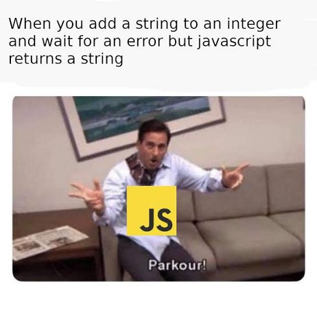

# **JavaScript Tips, Tricks, and Best Practices**

JavaScript, along with HTML and CSS, is one of the three essential
components of the internet. Any website you visit will almost certainly
utilize a combination of these three programming languages, each serving
a specific function.

JavaScript can be found anywhere.

If you care about the code itself and how it's written, rather than just
whether it works or not, you may say that you practice and value clean
code.

> A professional developer will write code for both the future self and
> the "other guy," not just the machine.

Based on this, clean code can be defined as code that is
self-explanatory, easy to understand by humans, and easy to change or
extend.

The focus of this post will be on **JavaScript**, *but the techniques
can be extended to other programming languages as well.*

## **1. When using the loose equality operator, be cautious.**

If necessary, the Loose Equality Operator (== OR !=) conducts automated
type conversion before comparison.

Use === instead of ==

Loose Equality Operator can produce surprising results, as shown in the
above example.

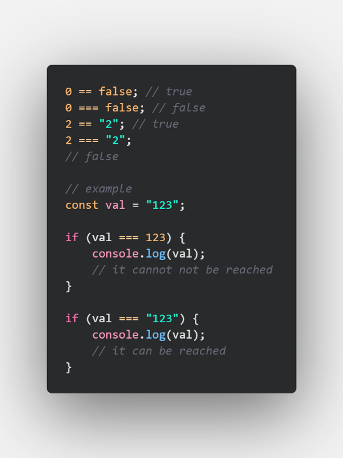

## **2. Simple method for swaping two variables**

Because it is concise and expressive, employ the destructuring
assignment strategy. Swapping is accomplished using a single line of
code. It supports any data type, including numbers, texts, booleans, and
objects.

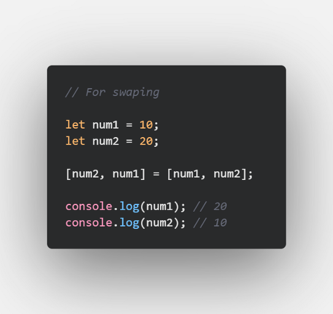

## **3. Replace if true statements with &&**

&& operators are less commonly used, but will become more common in the
future.

**Bad **👎

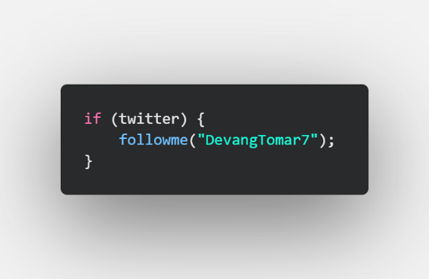

**Good 👍**

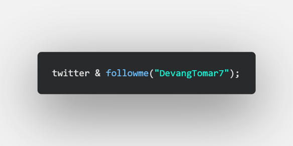

## **4. Passing arguments as objects**

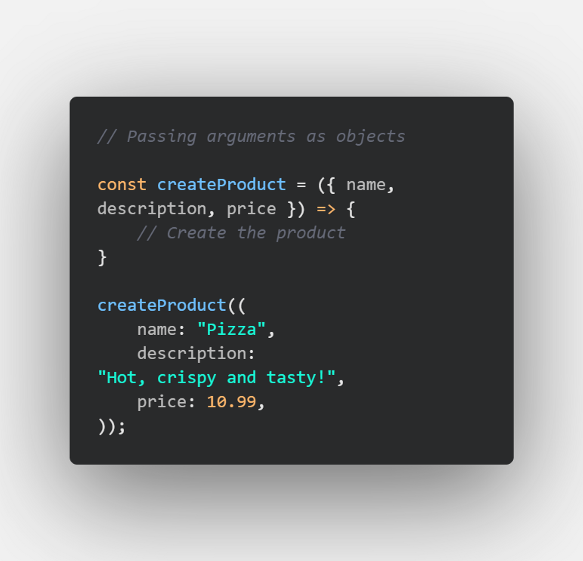

This method of presenting arguments has numerous advantages :

-   The order of the parameters is no longer important, allowing you to
    > focus on delivering high-quality code rather than repeatedly
    > checking the function definition.

-   The IDE will focus on the specific argument that you are providing,
    > making auto-completion easier.

-   As function calls specify the value of each property, this method
    > clearly communicates intent.

-   Large codebases will benefit greatly from the increased verbosity.

## **5. Format JSON output with spaces**

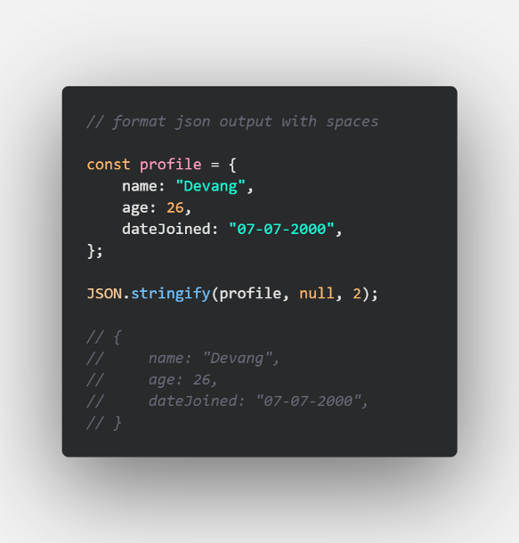

A simple yet powerful tool for exporting readable JSON by specifying the
number of spaces to use for indentation in the third parameter.

The second parameter is the replacer, which can be either a function
that controls the stringifying process or an array that specifies the
names of the properties that should be included in the stringified
output.

## **6. Use the spread operator to shallow copy objects (and arrays!)**

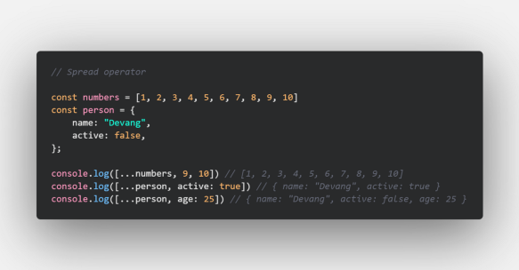

The spread syntax in JavaScript has made it easier than ever to expand
objects or arrays and conduct copies.

It is extremely useful for performing state management in React or React
Native because all you have to do is copy the current state using the
object literal, adjust your chosen properties, then update the state
with the useState state hook.

It's also a great technique to concatenate arrays or merge objects with
a single line of code, rather than having to go over each instance and
merge manually.

## **7. Remove duplicates from arrays using Set**

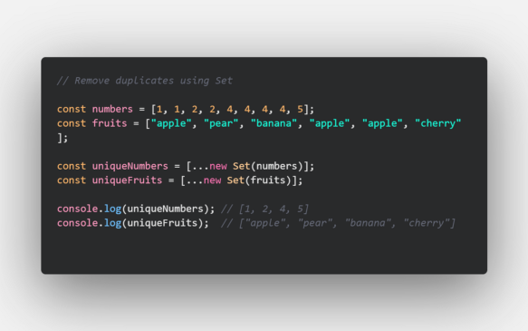

A basic but very effective one-liner approach for deleting duplicates
from arrays.

In this example, we also used the newly demonstrated spread operator to
expand the set and produce an array.

This method works with values of any type and even handles some of
JavaScript's strange equality quirks.

Sets can also be used to remove duplicates from complex object arrays.

## **8. Use reduce() map() and filter() instead of regular for loops**

**Use the reduce() method to reduce an array to a single value.**

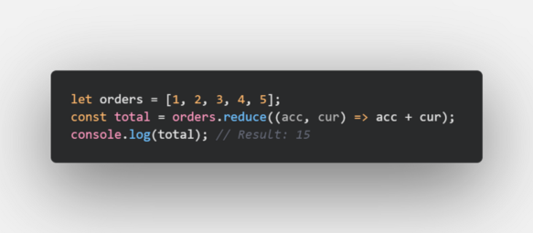

**Use the map() method to create a new array with the results of calling
a function for every array element.**

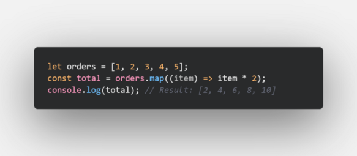

**Use the filter() method to create an array filled with all array
elements that pass a test (provided as a function).**

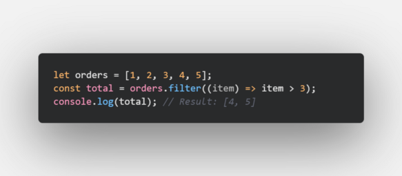

## **9. Conditional Operator**

Any **if..else** statement can be changed to a conditional statement
using the following syntax :

condition ? (expression if true) : (expression if false)

For example, the following code :

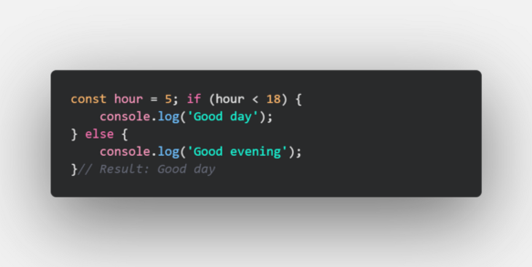

Can be reduced to :

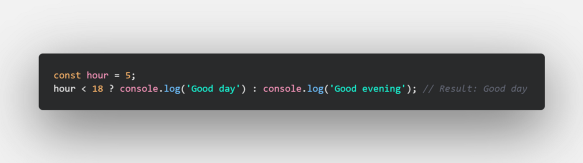

## **10. Strings on Steroids**

Embed a variable in-between a string :

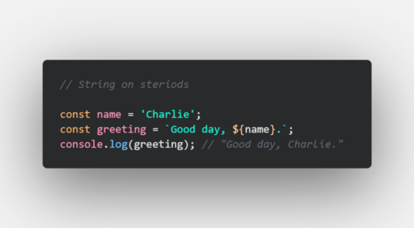

## **11. Convert a Number to a String**

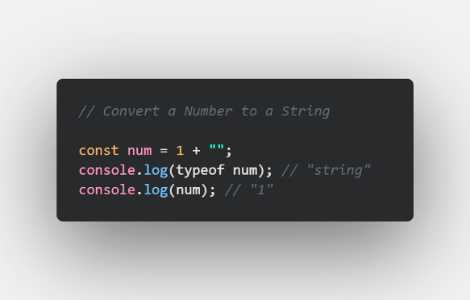

## **12. Convert a String to a Number**

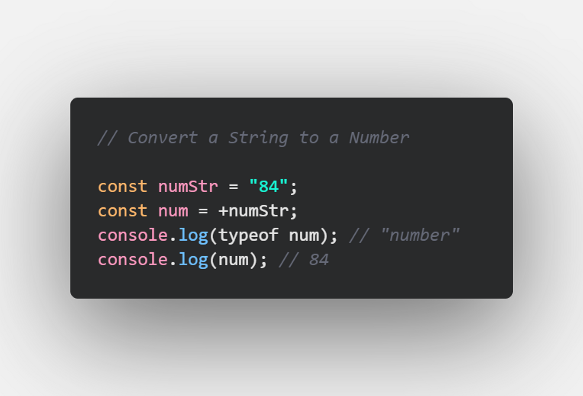

## **13. Split a String into an Array**

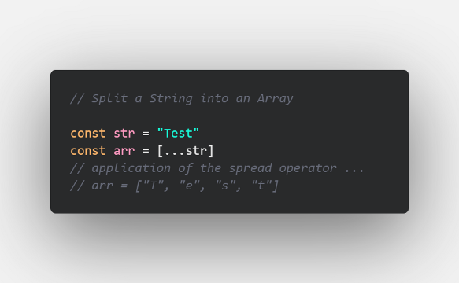

## **14. String to a number using the plus (+) operator**

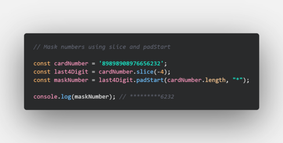

The ***slice() ***method returns selected elements in an array, as a new
array. Negative numbers select from the end of the array.

The ***padStart() ***method pads the current string with another string
until the resulting string reaches the given length. The padding is
applied from the start of the current string.

Masking is possible with less code.

I have also compiled this as a readme over my GitHub. Fancy checking it
out? here it is.

# **GitHub URL for this article 💻**

## [GitHub - devangtomar/js-tips-and-tricks](https://github.com/devangtomar/js-tips-and-tricks)

### [You can\'t perform that action at this time. You signed in with another tab or window. You signed out in another tab or...](https://github.com/devangtomar/js-tips-and-tricks)

[github.com](https://github.com/devangtomar/js-tips-and-tricks)

# **Conclusion 💡**

Thank you for reading; these are some of the best JavaScript developer
tips and best practises to follow for increased productivity and code
readability.

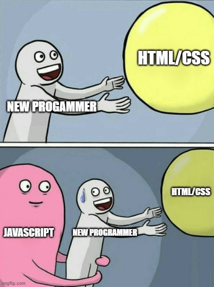

# **Let's connect and chat! Open to anything under the sun 🏖️🍹**

**🐦 Twitter
:** [[devangtomar7]{.underline}](https://twitter.com/devangtomar7)\
🔗 **LinkedIn
: **[[devangtomar]{.underline}](https://www.linkedin.com/in/devangtomar)\
📚 **Stackoverflow
:** [[devangtomar]{.underline}](https://stackoverflow.com/users/8198097/devangtomar)\
🖼️ **Instagram
:** [[be_ayushmann]{.underline}](https://instagram.com/be_ayushmann)\
Ⓜ️ **Medium :** [[Devang
Tomar]{.underline}](https://medium.com/u/8f5e1c86129d?source=post_page-----e42119a306ca--------------------------------)\
☊ **Hashnode
:** [[devangtomar]{.underline}](https://devangtomar.hashnode.dev/)\
🧑‍💻 **Dev.to :** [[devangtomar]{.underline}](https://dev.to/devangtomar)
